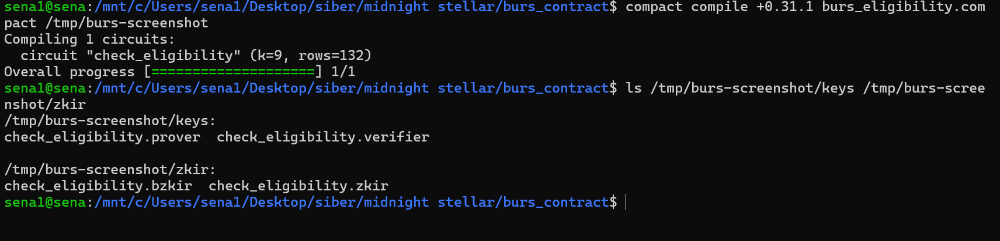
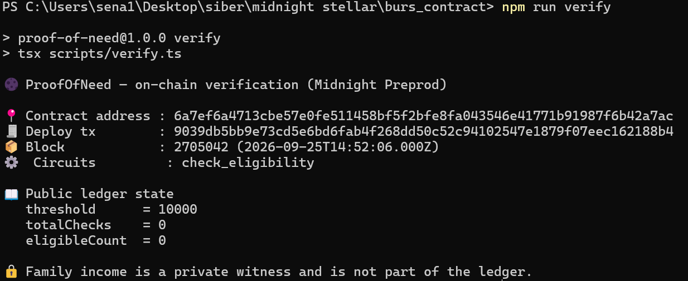

# ProofOfNeed: Prove your need, not your income

*İhtiyacını kanıtla, gelirini söyleme.*

ProofOfNeed is a scholarship eligibility contract on Midnight. A student proves with a zero-knowledge proof that their family income is below the threshold set by a foundation. The income itself is never written to the chain and never leaves the student's device.

## Product idea

Applying for a scholarship today means handing your family's income, occupations and employers to a clerk or a foundation officer. That is far more personal data than the decision needs, and for many families the process is humiliating. All the foundation actually needs to know is whether the student is below the threshold. In ProofOfNeed the foundation publishes the threshold on-chain, the student generates a proof using their income only on their own device, and the network verifies that proof. The foundation sees a yes or no answer and never sees the number. Later stages will pay eligible students a monthly stipend from donor funds.

## Public state vs private witness

In Compact, circuit inputs are private by default. `disclose()` does not make a value public by itself. It is how you tell the compiler you knowingly accept that the value may be exposed. A value only becomes visible when it crosses into a public domain: when it is written to the ledger, returned from an exported circuit, or passed to another contract.

The contract ([burs_eligibility.compact](burs_eligibility.compact)) draws the line like this:

| | What | Where | Who can see it |
|---|---|---|---|
| Public ledger | `threshold` | Chain | Everyone. The foundation's rule should be transparent anyway. |
| Public ledger | `totalChecks`, `eligibleCount` | Chain | Everyone. How many checks ran and how many passed. |
| Circuit result | `check_eligibility()` return value (Boolean) | Transaction transcript | Everyone. Only eligible or not eligible. |
| Private witness | `familyIncome()` | Student's device | Only the student. |

`familyIncome()` is a `witness`. The student's local DApp supplies its value ([src/witnesses.ts](src/witnesses.ts)), and that value is only used inside the ZK proof. In the circuit, `disclose()` is applied to the result of the comparison and nothing else:

```compact
export circuit check_eligibility(): Boolean {
    const eligible = disclose(familyIncome() < threshold);
    ...
}
```

If you try to write the income itself to the ledger or return it, the compiler rejects the program unless you wrap it in `disclose()`. That catches an accidental income leak at compile time.

Someone watching the chain can see the threshold, how many checks were made and the result of each check. They cannot see the income figure, occupations or any family details.

## Project structure

```
burs_eligibility.compact   Compact contract
managed/burs_eligibility/  Compiler output (circuit, prover/verifier keys, zkir, TS bindings)
src/witnesses.ts           Private state type and the familyIncome witness implementation
tests/                     Local simulator and tests that run the compiled contract
scripts/deploy.ts          Preprod deploy script
frontend/                  Web UI (Level 2 scope)
```

## Setup

Requirements:

- Node.js 22 or later
- The Compact toolchain with compiler 0.31.1. On Windows, install it inside WSL (Ubuntu).

```bash
curl --proto '=https' --tlsv1.2 -LsSf https://github.com/midnightntwrk/compact/releases/latest/download/compact-installer.sh | sh
compact update 0.31.1
```

The compiler version matters. The stable Midnight SDK (midnight-js 4.x) uses compact-runtime 0.16, which is what 0.31.1 targets. Newer compilers generate code for a different runtime.

Clone the repository and install dependencies:

```bash
git clone https://github.com/themlie/stellarMidnight-ProofOfNeed.git
cd stellarMidnight-ProofOfNeed
npm install
```

### Compile

```bash
npm run compile
```

This runs `compact compile +0.31.1 burs_eligibility.compact managed/burs_eligibility` and regenerates the `managed/` directory.



### Tests

```bash
npm test
```

The tests execute the compiled contract on `compact-runtime` and pass the income in as a private witness. They cover income below, above and equal to the threshold, zero income, the ledger state after deploy, and check that no income-related field exists on the ledger.

### Deploy to Preprod

1. Run the deploy script:

   ```bash
   npm run deploy
   ```

   On the first run the script creates a new wallet and writes its seed to `.env`. `.env` is excluded from git. Back the seed up somewhere safe as well.

   The first sync replays the whole Preprod history, so it takes a long time. The script saves its progress to `.wallet-cache/` every minute, and the next run picks up where it left off.

2. The script prints the wallet's unshielded address. Send tNIGHT to it from the [Preprod faucet](https://faucet.preprod.midnight.network).

3. Once the tNIGHT arrives, the script registers it for DUST generation. Transaction fees are paid in DUST, and DUST is generated over time from the NIGHT you hold, so you never need to transfer or swap for DUST. When a DUST balance appears, the contract is deployed with `threshold = 10000` and the address is written to `deployment-preprod.json`.

ZK proofs are generated in-process with WASM, so Docker is not required. This contract's keys are read from `managed/`, and the wallet's built-in zswap/dust keys are downloaded on first use. To use a local proof server instead:

```bash
docker run -d -p 6300:6300 midnightntwrk/proof-server:8.1.0 midnight-proof-server -v
PROOF_SERVER_URL=http://127.0.0.1:6300 npm run deploy
```

## Deployment

- Network: Midnight Preprod
- Contract address: `<ADDED_AFTER_DEPLOY>`


