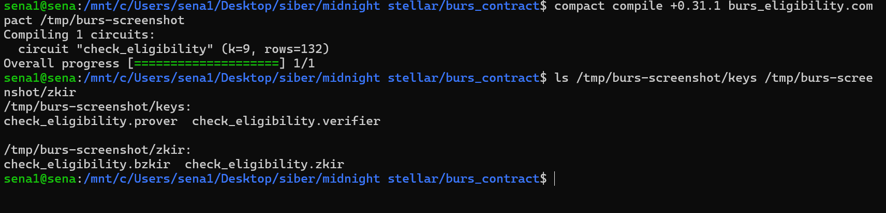
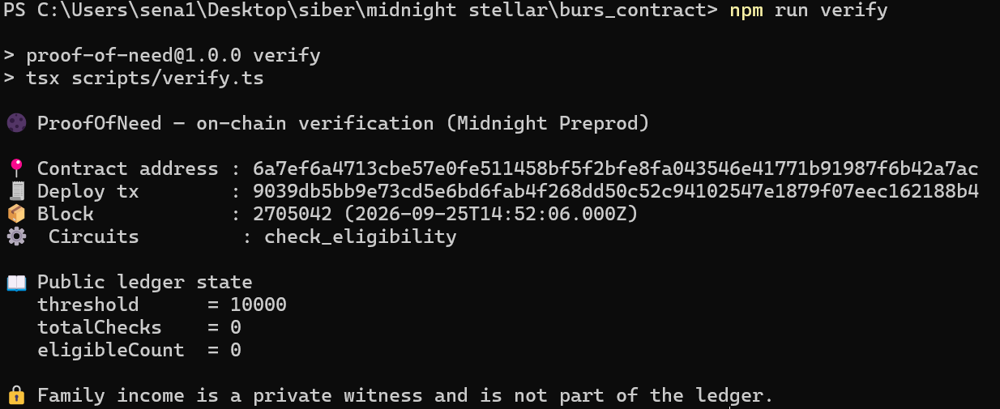

# ProofOfNeed: Prove your need, not your income

[](https://github.com/themlie/stellarMidnight-ProofOfNeed/actions/workflows/ci.yml)

*İhtiyacını kanıtla, gelirini söyleme.*

ProofOfNeed is a scholarship eligibility dApp on Midnight. A student proves with a zero-knowledge proof that their family income is below the threshold set by a foundation. The income never goes on-chain and never leaves the student's machine, and each student can apply only once without revealing who they are.

**Live demo:** https://stellar-midnight-proof-of-need-sfh6.vercel.app/ (reads the contract on Midnight Preprod; submitting a proof needs Lace on Preprod and a local proof server, see [Running the dApp](#running-the-dapp)).

## Product idea

Applying for a scholarship today means handing your family's income, occupations and employers to a clerk or a foundation officer. That is far more personal data than the decision needs, and for many families the process is humiliating. All the foundation actually needs to know is whether the student is below the threshold. In ProofOfNeed the foundation publishes the threshold on-chain, the student generates a proof using their income only on their own device, and the network verifies that proof. The foundation sees a yes or no answer and never sees the number. Later stages will pay eligible students a monthly stipend from donor funds.

## Privacy model

In Compact, circuit inputs are private by default. `disclose()` does not make a value public by itself. It is how you tell the compiler you knowingly accept that the value may be exposed. A value only becomes visible when it crosses into a public domain: when it is written to the ledger, returned from an exported circuit, or passed to another contract.

The contract ([burs_eligibility.compact](burs_eligibility.compact)) draws the line like this:

| | What | Where | Who can see it |
|---|---|---|---|
| Public ledger | `threshold` | Chain | Everyone. The foundation's rule should be transparent anyway. |
| Public ledger | `totalChecks`, `eligibleCount` | Chain | Everyone. How many checks ran and how many passed. |
| Public ledger | `applications` (set of nullifiers) | Chain | Everyone. One anonymous 32-byte tag per student who applied. |
| Circuit result | `check_eligibility()` return value (Boolean) | Transaction transcript | Everyone. Only eligible or not eligible. |
| Private witness | `familyIncome()` | Student's machine | Only the student. |
| Private witness | `studentSecret()` | Student's browser | Only the student. |

Both witnesses are supplied by the student's DApp ([src/witnesses.ts](src/witnesses.ts)) and only used inside the ZK proof. The circuit discloses two things and nothing else:

```compact
export circuit check_eligibility(): Boolean {
    const nullifier = disclose(applicationNullifier(studentSecret()));
    assert(!applications.member(nullifier), "Already applied");
    applications.insert(nullifier);

    const eligible = disclose(familyIncome() < threshold);
    ...
}
```

The nullifier is `persistentHash("proofofneed:application:", secret)`. Publishing it lets the contract refuse a second application from the same secret, but a hash does not reveal the secret, the student's identity or which wallet paid the fee. The nullifier is spent even when the student is not eligible, so a rejected student cannot retry with a smaller number.

If you try to write the income or the secret to the ledger, or return them, the compiler rejects the program unless you wrap them in `disclose()`. That catches an accidental leak at compile time.

**What an observer can learn:** the threshold, how many students applied, how many were eligible, and for each application an anonymous nullifier with a yes/no result.

**What an observer cannot learn:** any income figure, how far above or below the threshold a student was, occupations or family details, or which person or wallet a nullifier belongs to.

### Privacy claim and how the dApp shows it

The frontend makes the claim observable instead of asking you to trust it. After each proof it shows a privacy check that lists what left the browser:

- the size of the exact transaction handed to Lace for submission,
- a byte search of that transaction for the income (as a 64-bit value, both byte orders) and for the student secret, which should both come back "not found",
- the nullifier that was published instead,
- the public ledger before and after the call, where only the counters and the nullifier set change.

Two honest limits:

- Proving happens on the student's machine. The DApp hands the witness data to the prover Lace is configured with, which is a local proof server (`http://localhost:6300`). It never goes to the network, the foundation or any server we run.
- The student secret lives in the browser's `localStorage`, one per contract. Clearing site data creates a new secret, so the nullifier stops accidental or casual double applications, not a determined person with many browsers. Binding the secret to a verified identity (for example a signed e-Devlet income attestation) is planned for a later level.

## Project structure

```
burs_eligibility.compact   Compact contract
managed/burs_eligibility/  Compiler output (circuit, prover/verifier keys, zkir, TS bindings)
src/witnesses.ts           Private state type and witness implementations
tests/                     Local simulator and tests that run the compiled contract
scripts/wallet.ts          Shared Preprod wallet setup (seed, WASM proving, sync cache, DUST)
scripts/deploy.ts          Preprod deploy script
scripts/verify.ts          Reads the deployed contract back from the indexer
frontend/                  Browser dApp (Vite + Midnight SDK + Lace)
```

## Setup

Requirements:

- Node.js 22 or later
- The Compact toolchain with compiler 0.31.1. On Windows, install it inside WSL (Ubuntu).

```bash
curl --proto '=https' --tlsv1.2 -LsSf https://github.com/midnightntwrk/compact/releases/latest/download/compact-installer.sh | sh
compact update 0.31.1
```

The compiler version matters. The stable Midnight SDK (midnight-js 4.x) uses compact-runtime 0.16, which is what 0.31.1 targets. Newer compilers generate code for a different runtime.

Clone the repository and install dependencies:

```bash
git clone https://github.com/themlie/stellarMidnight-ProofOfNeed.git
cd stellarMidnight-ProofOfNeed
npm install
npm --prefix frontend install
```

### Compile

```bash
npm run compile
```

This runs `compact compile +0.31.1 burs_eligibility.compact managed/burs_eligibility` and regenerates the `managed/` directory.



### Tests

```bash
npm test
```

The 10 tests execute the compiled contract on `compact-runtime` with the income and the student secret passed in as private witnesses. They cover income below, above and equal to the threshold, zero income, a second application with the same secret, a rejected student retrying with a lower income, several different students, and check that the ledger holds only counters and nullifier hashes, never the income or the secret.

The frontend has its own application tests (22, Vitest) for the logic behind the privacy check and the nullifier: the byte search for the income in a submitted transaction, flattening Lace and Effect errors into readable messages, persisting the student secret, and the nullifier staying stable for a student and distinct between students.

```bash
npm --prefix frontend test
```

### Continuous integration

[.github/workflows/ci.yml](.github/workflows/ci.yml) runs on every push and pull request:

- installs the Compact toolchain and compiler 0.31.1, compiles the contract and fails if the committed `managed/` output does not match the source,
- runs the contract tests and type-checks the CLI scripts,
- runs the frontend application tests and builds the frontend the same way Vercel does.

### Deploy to Preprod

1. Run the deploy script:

   ```bash
   npm run deploy
   ```

   On the first run the script creates a new wallet and writes its seed to `.env`. `.env` is excluded from git. Back the seed up somewhere safe as well.

   The first sync replays the whole Preprod history, so it takes a long time. The script saves its progress to `.wallet-cache/` every minute, and the next run picks up where it left off.

2. The script prints the wallet's unshielded address. Send tNIGHT to it from the [Preprod faucet](https://faucet.preprod.midnight.network).

3. Once the tNIGHT arrives, the script registers it for DUST generation. Transaction fees are paid in DUST, and DUST is generated over time from the NIGHT you hold, so you never need to transfer or swap for DUST. When a DUST balance appears, the contract is deployed with `threshold = 10000` and the address is written to `deployment-preprod.json`.

The deploy script proves in-process with WASM, so it does not need Docker. To use a proof server instead, set `PROOF_SERVER_URL=http://127.0.0.1:6300`.

## Running the dApp

The browser dApp needs the Lace wallet and a local proof server, because Lace proves the student's transaction on the student's machine.

1. **Start a proof server.** With Docker:

   ```bash
   docker run -d --name proof-server --restart unless-stopped -p 6300:6300 midnightntwrk/proof-server:8.1.0 midnight-proof-server -v
   ```

   On Windows, if Docker Desktop does not start, installing Docker Engine inside WSL (`sudo apt-get install -y docker.io`, then `sudo systemctl enable --now docker`) and running the same command there works too. WSL forwards `localhost:6300` to Windows.

2. **Prepare Lace.** Switch the Midnight wallet to Preprod, and under Settings » Midnight select the local proof server (`http://localhost:6300`). Request tNIGHT from the [Preprod faucet](https://faucet.preprod.midnight.network) to your unshielded address, then press **Generate tDUST** on the wallet's main screen. Lace has to sync the DUST history once before the tDUST tank shows a balance, which can take a while.

3. **Start the dApp.**

   ```bash
   npm --prefix frontend run dev
   ```

   Open http://localhost:4000 (plain `http`), press **Connect**, choose **I'm a Student** and approve in Lace.

4. **Apply.** Enter a monthly family income and press **Apply for Scholarship / Prove Eligibility**. Lace asks you to approve the transaction. The result, the nullifier and the privacy check appear under the form. The Foundation tab shows the live public ledger, and a second application from the same browser is refused before any fee is paid.

## Deployments

Current contract (Level 2, with one application per student):

| | |
|---|---|
| Network | Midnight Preprod |
| Contract address | `6ec4f7700d5ae009284841ceab24340e6601fec42b0f12a9bbb48f9ae85e3d44` |
| Deploy transaction | `3a44f31e7f5e5c4d02194fec1e113546540ec1ccf667b2044cd4c7c7d8fdc25b` |
| Block | 2720552 |
| Initial threshold | 10000 |

The same data is in [deployment-preprod.json](deployment-preprod.json). To read the contract back from the Preprod indexer and decode its public ledger state:

```bash
npm run verify
```

The Level 1 contract (income check only, no nullifier) is still on Preprod at `6a7ef6a4713cbe57e0fe511458bf5f2bfe8fa043546e41771b91987f6b42a7ac` (block 2705042). The `level-1` tag holds the code and README from that submission.


