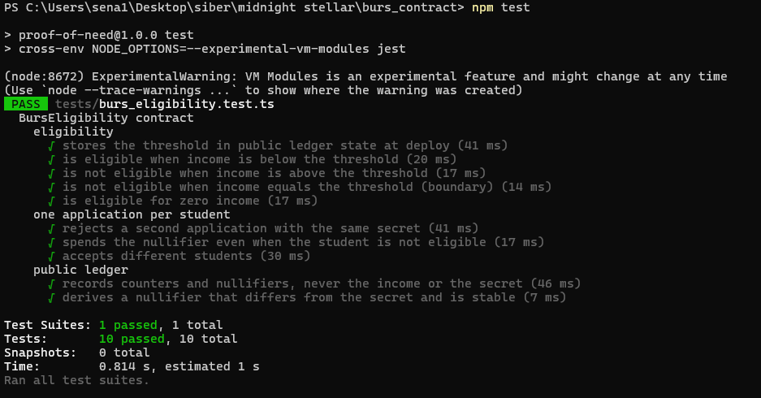
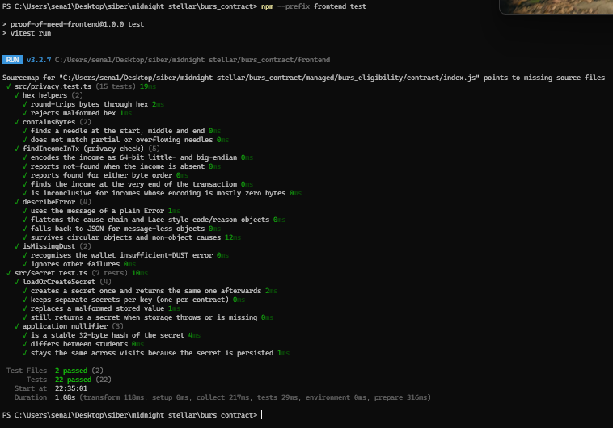

# Tests

ProofOfNeed has two test suites. Both run in GitHub Actions on every push ([.github/workflows/ci.yml](../.github/workflows/ci.yml)) and list every test by name in the job log.

| Suite | File | Runner | Tests |
|---|---|---|---|
| Contract (circuit and ledger) | [tests/burs_eligibility.test.ts](../tests/burs_eligibility.test.ts) | Jest | 10 |
| Application (privacy check, errors, secret, nullifier) | [frontend/src/privacy.test.ts](../frontend/src/privacy.test.ts), [frontend/src/secret.test.ts](../frontend/src/secret.test.ts) | Vitest | 22 |

```bash
npm test                    # contract tests
npm --prefix frontend test  # application tests
```

## Contract tests

The contract tests run the **compiled** contract from `managed/burs_eligibility` on `@midnight-ntwrk/compact-runtime`, with no node or proof server. [tests/simulator.ts](../tests/simulator.ts) deploys it with a threshold of 10000 and calls `check_eligibility`, passing the income and the student secret in as private witnesses exactly as the dApp does. Each call runs the real circuit logic and updates a real ledger state, which the tests then read back through the generated `ledger()` accessor.

| Test | What it shows |
|---|---|
| stores the threshold in public ledger state at deploy | The constructor writes `threshold` and starts the counters and the nullifier set empty. |
| is eligible when income is below the threshold | 8000 < 10000 returns `true`. |
| is not eligible when income is above the threshold | 15000 returns `false`. |
| is not eligible when income equals the threshold (boundary) | 10000 returns `false`: the comparison is strict. |
| is eligible for zero income | The lower edge of `Uint<64>` works. |
| rejects a second application with the same secret | The same student secret fails with `Already applied` and the counters do not move. |
| spends the nullifier even when the student is not eligible | A rejected student cannot retry with a lower income. |
| accepts different students | Different secrets give different nullifiers; both are recorded. |
| records counters and nullifiers, never the income or the secret | After three applications the ledger has exactly `threshold`, `totalChecks`, `eligibleCount` and `applications`; each nullifier is in the set and no secret is. |
| derives a nullifier that differs from the secret and is stable | `applicationNullifier` is deterministic and does not echo the secret. |



Output:

```
PASS tests/burs_eligibility.test.ts
  BursEligibility contract
    eligibility
      √ stores the threshold in public ledger state at deploy
      √ is eligible when income is below the threshold
      √ is not eligible when income is above the threshold
      √ is not eligible when income equals the threshold (boundary)
      √ is eligible for zero income
    one application per student
      √ rejects a second application with the same secret
      √ spends the nullifier even when the student is not eligible
      √ accepts different students
    public ledger
      √ records counters and nullifiers, never the income or the secret
      √ derives a nullifier that differs from the secret and is stable
Test Suites: 1 passed, 1 total
Tests:       10 passed, 10 total
```

The same circuit has also been exercised on Midnight Preprod against the deployed contract (`npm run apply`, see the README's "On-chain usage" section): an eligible application, a refused repeat from the same student, and a not-eligible application.

## Application tests

These cover the frontend logic that the privacy claim depends on.



| Area | What is checked |
|---|---|
| Hex helpers | Round-trips and rejects malformed input. |
| `containsBytes` | Finds a byte sequence at the start, middle and end, and never matches partial or overflowing needles. |
| `findIncomeInTx` (privacy check) | Encodes the income as 64-bit little- and big-endian, reports `not-found` when absent, `found` for either byte order and at the end of the buffer, and `inconclusive` for incomes below 256 whose encoding is mostly zero bytes. |
| `describeError` | Turns Lace and Effect errors (code and reason objects, `_tag`, cause chains, message-less and circular objects) into readable text. |
| `isMissingDust` | Recognises the wallet's insufficient-DUST error and nothing else. |
| `loadOrCreateSecret` | Creates the student secret once and reuses it, keeps one secret per contract, replaces malformed stored values, and still works when storage is blocked. |
| Application nullifier | Uses the contract's own `applicationNullifier` pure circuit: 32 bytes, stable for a student, different between students, and the same across visits because the secret is persisted. |

Output:

```
 ✓ src/privacy.test.ts > hex helpers > round-trips bytes through hex
 ✓ src/privacy.test.ts > hex helpers > rejects malformed hex
 ✓ src/privacy.test.ts > containsBytes > finds a needle at the start, middle and end
 ✓ src/privacy.test.ts > containsBytes > does not match partial or overflowing needles
 ✓ src/privacy.test.ts > findIncomeInTx (privacy check) > encodes the income as 64-bit little- and big-endian
 ✓ src/privacy.test.ts > findIncomeInTx (privacy check) > reports not-found when the income is absent
 ✓ src/privacy.test.ts > findIncomeInTx (privacy check) > reports found for either byte order
 ✓ src/privacy.test.ts > findIncomeInTx (privacy check) > finds the income at the very end of the transaction
 ✓ src/privacy.test.ts > findIncomeInTx (privacy check) > is inconclusive for incomes whose encoding is mostly zero bytes
 ✓ src/privacy.test.ts > describeError > uses the message of a plain Error
 ✓ src/privacy.test.ts > describeError > flattens the cause chain and Lace style code/reason objects
 ✓ src/privacy.test.ts > describeError > falls back to JSON for message-less objects
 ✓ src/privacy.test.ts > describeError > survives circular objects and non-object causes
 ✓ src/privacy.test.ts > isMissingDust > recognises the wallet insufficient-DUST error
 ✓ src/privacy.test.ts > isMissingDust > ignores other failures
 ✓ src/secret.test.ts > loadOrCreateSecret > creates a secret once and returns the same one afterwards
 ✓ src/secret.test.ts > loadOrCreateSecret > keeps separate secrets per key (one per contract)
 ✓ src/secret.test.ts > loadOrCreateSecret > replaces a malformed stored value
 ✓ src/secret.test.ts > loadOrCreateSecret > still returns a secret when storage throws or is missing
 ✓ src/secret.test.ts > application nullifier > is a stable 32-byte hash of the secret
 ✓ src/secret.test.ts > application nullifier > differs between students
 ✓ src/secret.test.ts > application nullifier > stays the same across visits because the secret is persisted
 Test Files  2 passed (2)
      Tests  22 passed (22)
```
